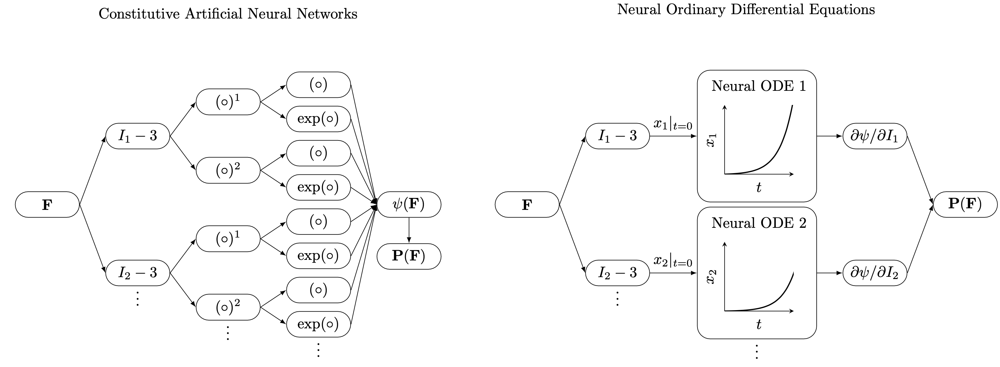

# Comparison of data-driven models of hyperelasticity

A rough comparison of Constitutive Artificial Neural Networks \[[github](https://github.com/LivingMatterLab/CANN) | [paper](https://arxiv.org/abs/2210.02202)\] and Neural ODEs \[[github](https://github.com/tajtac/NODE_v2) | [paper](https://www.sciencedirect.com/science/article/abs/pii/S0045782522003838)\].

