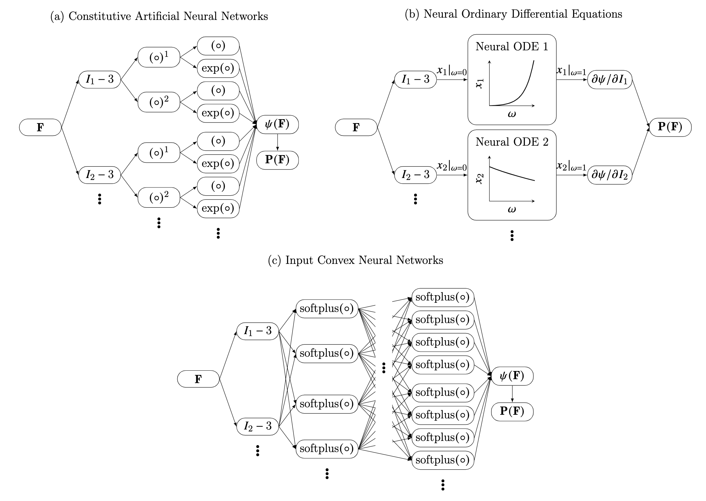

# Comparison of data-driven models of hyperelasticity

Benchmarking three recent methods in data-driven constitutive modeling of soft biological materials; Constitutive Artificial Neural Networks \[[github](https://github.com/LivingMatterLab/CANN) | [paper](https://arxiv.org/abs/2210.02202)\], Input Convex Neural Networks \[[paper 1](https://www.sciencedirect.com/science/article/pii/S0022509621003215?via%3Dihub) | [paper 2](https://onlinelibrary.wiley.com/doi/10.1002/nme.6957) | [paper 3](https://linkinghub.elsevier.com/retrieve/pii/S0093641322001252)\] and Neural ODEs \[[github](https://github.com/tajtac/NODE_v2) | [paper](https://www.sciencedirect.com/science/article/abs/pii/S0045782522003838)\].

