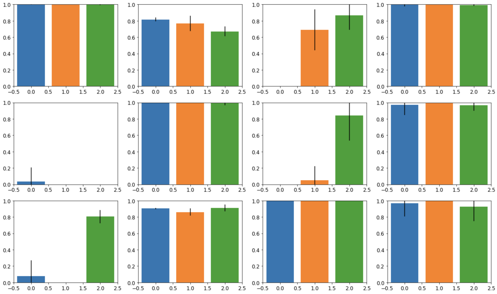
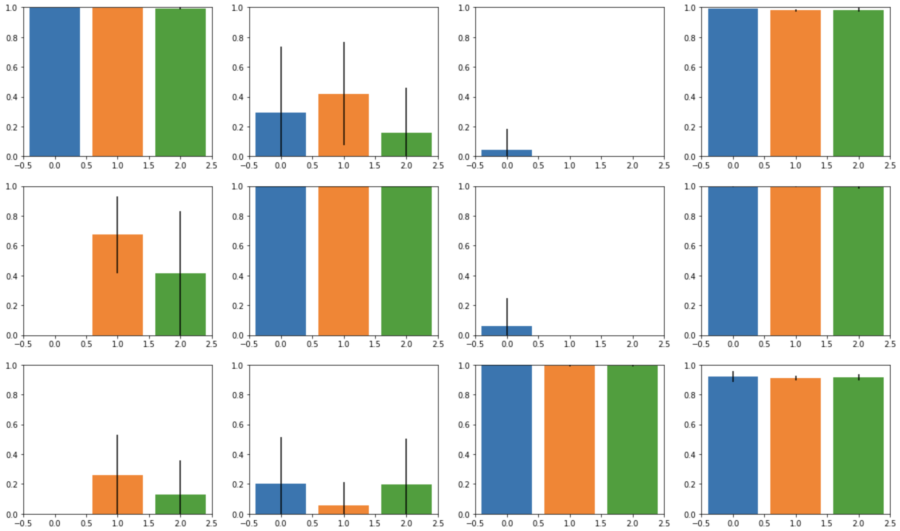
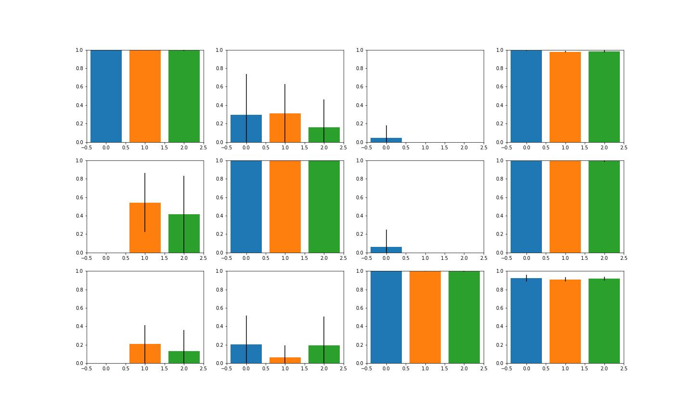
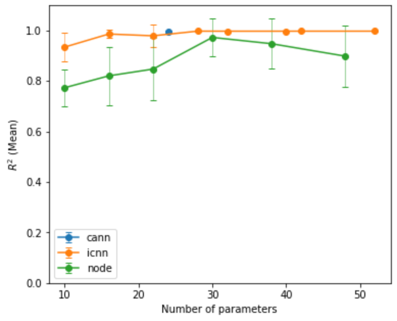
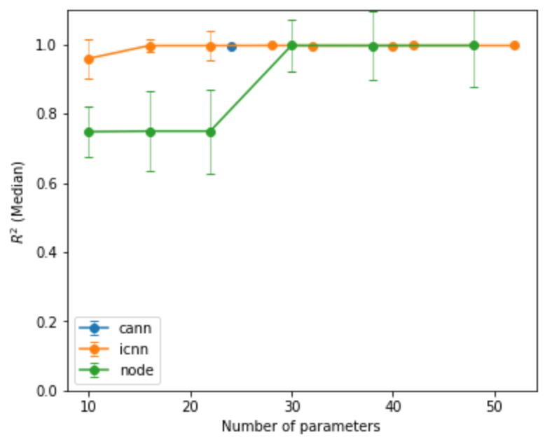
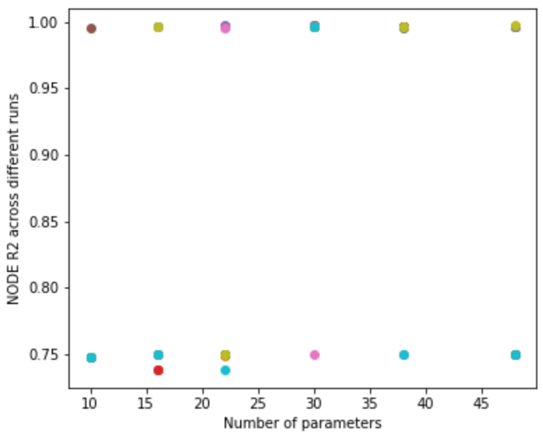
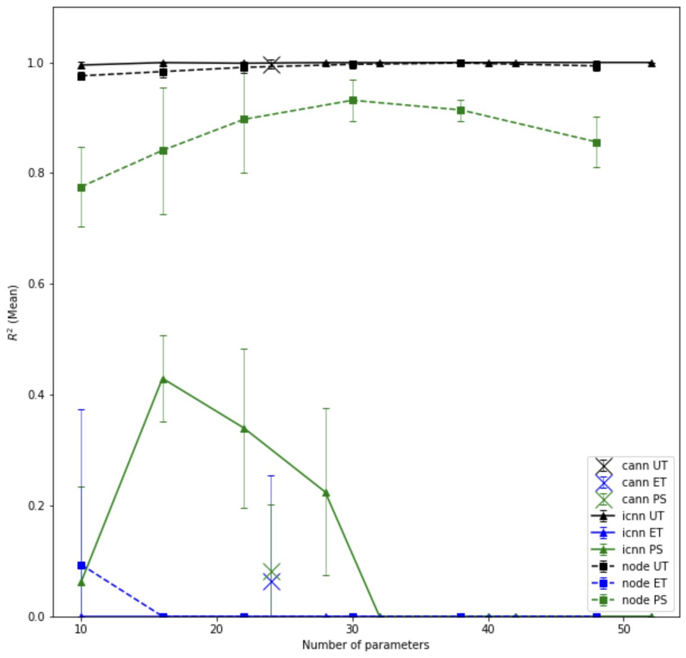
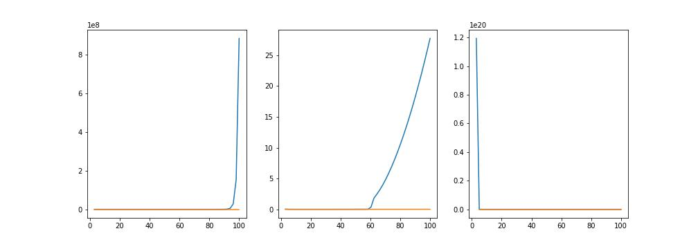
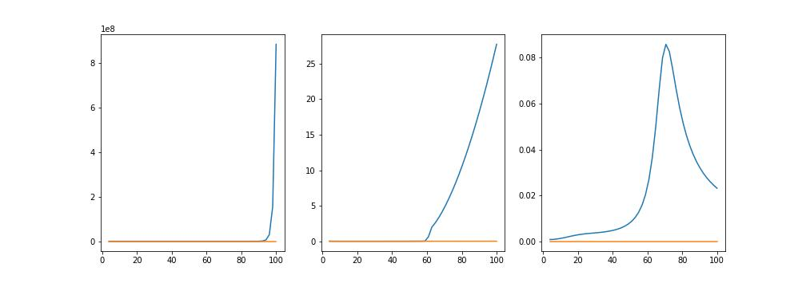

# Summary

## $R^2$ figure
### Rubber

### Skin
#### Before

#### After

## Efficiency figure
### Training on all rubber data

Sometimes the NODE gets stuck in local minima. Things I have tried to resolve this issue:
1. Try using median rather than mean
2. Reject initial guesses for parameters that leads to high initial loss
3. Increase/decrease learning rate (2.e-6 to 1.e-1)
4. both 2. and 3. at the same time

### Training on UT only

## Psi_ii figure

Restricting $I_i\geq 4$

